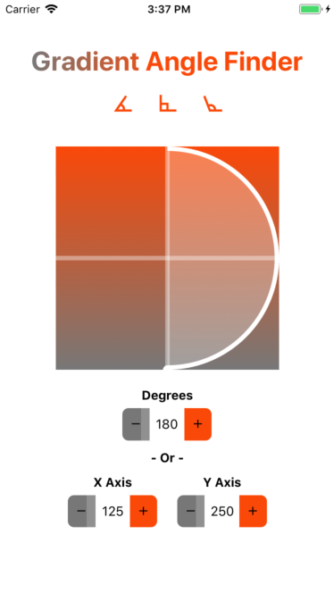

# GradientAngleFinder

Small demo using react-native to find the angle of a gradient.

**This app was NOT created with the `creative-native-app`. Check out the [building projects with native code](https://facebook.github.io/react-native/docs/getting-started.html) section of the getting started for both iOS AND Andriod. Follow the steps up until the `creating a new application` to ensure you have all the required things installed.**

### To Run:
* Clone repo
* CD into repo folder
* `npm install`
* `react-native link` to link all the libraries to the project
* IOS - `react-native run-ios`
* Android - `react-native run-android`
* `react-devtools` to run the optional dev tools

**If you are running into issue switching from IOS > Android and vice versa, try running `npm start -- -- reset cache` to clear your cache.**

#### Libraries Used:
* [react-native](https://facebook.github.io/react-native/)
* [react-devtools](https://github.com/facebook/react-devtools/tree/master/packages/react-devtools)
* [react-native-elements](https://react-native-training.github.io/react-native-elements/)
* [react-native-vector-icons](https://github.com/oblador/react-native-vector-icons)
* [react-native-svg](https://github.com/react-native-community/react-native-svg)
* [react-native-text-gradient](https://github.com/iyegoroff/react-native-text-gradient)
* [react-native-number-input](https://github.com/himelbrand/react-native-numeric-input)

**Note: There is a known issue with the text gradient package. To get around this, view [their fix](https://github.com/iyegoroff/react-native-text-gradient#usage-with-rn--0560).**

**Note: There is an issue with the react-native-number-input where you can not currently type in negative numbers. An [issue](https://github.com/himelbrand/react-native-numeric-input/issues/8) has been submitted for this.**

#### TODOs:
* Connect said drag and drops the form inputs so everything stays in sync
* Limit drag/drop to gradient box
* Allow negative degree motion
* Add Color pickers to update gradient colors (?)

